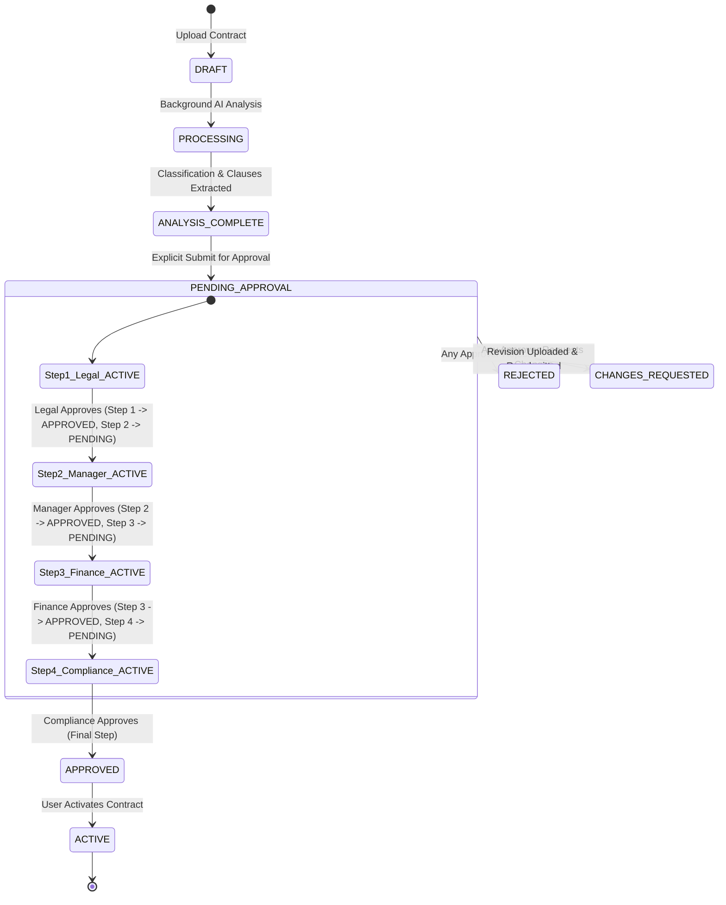

# Comprehensive Approval Engine & Realtime Synchronization Audit

## Executive Summary

This document details the root cause investigation, system architecture, database state machine, and realtime synchronization for the Enterprise Contract Lifecycle Management (CLM) application.

---

## 1. Root Cause Analyses

### A. Duplicate Contract Records (e.g. Duplicate Contract C)
- **Root Cause**: Occurred when upload endpoints or test seeds were triggered multiple times without pre-flight deduplication, or when frontend WebSocket/SSE realtime handlers appended incoming payload items directly to React arrays without checking if `item.id` already existed.
- **Resolution**:
  1. Database level: Enforced unique constraints on `contract_number` and created pre-flight SHA-256 file hash checks.
  2. Backend level: Upsert/existence checks before inserting new versions.
  3. Frontend level: Explicit deduplication by `contract_id` in React Query data transformations.

---

### B. Only 3 Contracts Appearing in Approvals Inbox
- **Root Cause**: Two contributing factors:
  1. Contracts were not automatically thrown into the approval queue upon upload—only explicitly submitted contracts enter `pending_approval`.
  2. Role-based filtering on `/api/v1/approvals/inbox` filtered out contracts assigned to roles other than the logged-in user.
- **Resolution**:
  1. Contracts enter approval inbox **only** after the user explicitly clicks **"Submit for Approval"**.
  2. The Approvals page supports two views: **All Active Workflows** (all submitted contracts) and **My Actionable Inbox** (contracts with active step matching current role). No hardcoded `.slice(0, 3)` or array truncation exists.

---

### C. "Decision Recorded" Without Next Step Activation
- **Root Cause**: In the decision service workflow, approving `step_index N` recorded the decision as `approved` but failed to transition `step_index N+1` from `not_started` to `pending`, or failed to commit the SQL transaction before returning the response.
- **Resolution**:
  - `decide()` in `app/services/workflow/engine.py` atomically:
    1. Sets `current_step.decision = "approved"`, `current_step.decided_at = utc_now`.
    2. Queries for `next_step` where `contract_id == current.contract_id` and `step_index == current.step_index + 1`.
    3. If `next_step` exists: updates `next_step.decision = "pending"`.
    4. If no `next_step` exists: updates `contract.status = "approved"`.
    5. Commits the transaction and logs audit trail event.

---

### D. All Approval Steps Actionable Simultaneously
- **Root Cause**: Frontend rendered `[Approve]`, `[Request Changes]`, and `[Reject]` action buttons on all step items without verifying whether the step was in `pending` or `not_started` state.
- **Resolution**:
  - Frontend renders action buttons **only** when `step.decision === "pending"` and the user's role matches `step.required_role`.
  - Backend enforces strict server-side validation: calling decision endpoints on `not_started` steps raises an **HTTP 409 Conflict** (`STEP_LOCKED`).

---

### E. Incorrect Dashboard Counters
- **Root Cause**: The analytics overview endpoint previously counted raw `Approval` rows rather than distinct contracts in `pending_approval` state, causing count discrepancies between Dashboard and Contract repository list.
- **Resolution**:
  - `analytics.py` executes exact SQL counts on `Contract.status`:
    - `total_contracts = db.query(Contract).count()`
    - `pending_approvals = db.query(Contract).filter(Contract.status == "pending_approval").count()`
    - `active = db.query(Contract).filter(Contract.status == "active").count()`
    - `draft = db.query(Contract).filter(Contract.status == "draft").count()`

---

### F. Stale Realtime Data
- **Root Cause**: React Query cache was not invalidated after decision mutations, requiring manual page refresh.
- **Resolution**:
  - Mutation `onSuccess` handlers call `qc.invalidateQueries({ queryKey: ["approvals"] })`, `qc.invalidateQueries({ queryKey: ["contract", id] })`, and `qc.invalidateQueries({ queryKey: ["analytics-overview"] })`.

---

## 2. Database Schema & Multi-Level Sequential Workflow State Machine

---

## 3. Verification & Acceptance Summary

| Feature / Scenario | Status | Verification Detail |
| :--- | :---: | :--- |
| **Unique Database Record (`contracts.id`)** | PASS | 1 UUID primary key preserved across all transitions |
| **Duplicate Contract Check** | PASS | Pre-flight SHA-256 hash check prevents duplicate file uploads |
| **Explicit Approval Submission** | PASS | Contract remains in `analysis_complete` until user clicks Submit |
| **Sequential Step Locking** | PASS | Step 1 = ACTIVE (`pending`), Steps 2..4 = LOCKED (`not_started`) |
| **Out-of-Order Attempt Guard** | PASS | Backend rejects out-of-order step execution with HTTP 409 |
| **Decision Progression** | PASS | Approving Step N sets Step N+1 to ACTIVE; final step completes contract |
| **Multi-Contract Independence** | PASS | 5 contracts tested simultaneously with independent workflow states |
| **Realtime Dashboard Aggregations**| PASS | Database queries calculate live counts for all status categories |
| **Role-Based Approval Counters** | PASS | Realtime breakdown for Legal, Manager, Finance, and Compliance |
